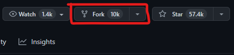
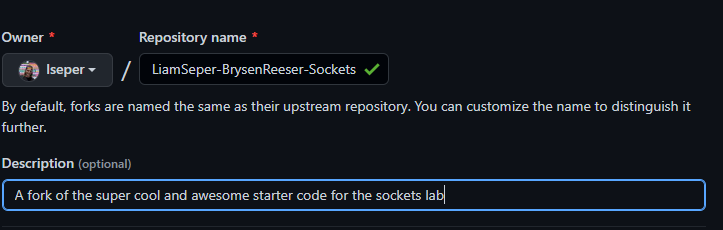
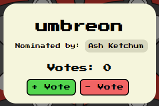

# Sockets & Two-Way Communication Lab

## Introduction

The purpose of this lab is to expose you to web sockets, a type of networking communication that is two-ways and built off of TCP socket protocol. We will be building off of the last lab, [HTTPS & API Basics](https://github.com/lseper/UNL-HTTP-API-Lab).

Here are some resources you will probably want a reference to while you complete the lab.

[Javascript's Web Sockets Documentation](https://developer.mozilla.org/en-US/docs/Web/API/WebSockets_API)

[What is a socket, anyway?](https://www.geeksforgeeks.org/what-is-web-socket-and-how-it-is-different-from-the-http/)

[PokeApi's Documentation (from last lab)](https://pokeapi.co/docs/v2)

[Server Code (optional, view if you'd like to)](https://github.com/lseper/Sockets-Lab-Server)

And again, like all programming tasks, the internet is your friend, and searching for resources that will _help_ is encouraged! However, strictly copy and pasting code is _not_, and is not the intention for this lab! This includes ChatGPT! It can be helpful as a resource, but blindly copy and pasting code from there will _probably_ not work, and likely give you more of a headache.

## Getting Started

To begin the lab, first you'll want to fork the repository by clicking the **Fork** button on the top right corner of this page. You'll see that a lot of this code is from the previous lab!



Then, set yourself as the owner of the forked repository. Make sure you set the name of the repository in the format of `Partner1Name-Partner2Name-Sockets`. For example, `LiamSeper-BrysenReeser-Sockets`



You'll then want to clone the repository onto your local machine.

Finally, to run the code locally, simply right click the file `index.html` in your file explorer, and open it in your web browser.

## Familiarizing Yourself with the UI

The website is very similar to the website you developed in the last [HTTPS & API Basics Lab](https://github.com/lseper/UNL-HTTP-API-Lab), except for some new additions. For now, just do the same as you did at the end of the previous lab, and type in some of your favorite pokemon to catch. Click the "Catch 'Em All" button. You should notice there's now a "Nominate" button on the bottom of them. Clicking this will nominate a pokemon for the title of "Best Pokemon", the functionality for which you will be writing in this lab.

Under our bar of pokemon inputs, there is a new input field for entering a username, next to a "Join the Indigo League" button. Pressing this will connect to the server with your specified username. Note that it doesn't work just yet - you'll write that functionality in the lab.

You'll also see the "Nominations Remaining" and "Votes Remaining" text, along with a "Sort Nominees" button. These display your personal nominations and votes remaining for voting on the best pokemon.

Now that you've familiarized yourself with most of the UI, let's jump into the actual code itself.

## Familiarizing Yourself with the Starter Code

Open the file `index.js`. It's a lot, but don't be scared! Most of it you won't have to touch, or even understand, just stay with me in reading through this README.

At the top of the file, the variables `socket`, `votes`, `nominations`, `username`, `id`, `URL`, and `nominees` are declared. (Note: you can ignore `myVotes` and `_heartbeat` for now. `myVotes` is used for UI logic that you won't have to touch, and `_heartbeat` is used to ensure your connection to the server persists, unless you close the tab/window) These are used for functionality throughout this app, and you'll need them when writing the logic to complete the lab, so remember them!

Scroll down until you see the `updateNominees` function. It's pretty big! But don't worry, you don't have to understand it. You will be using this helper function to update the `nominees` variable at the top of the file given new `newNominees` you pass into it.

Scrolling down will reveal functions marked with a `TODO` comment. These are functions you have to write (or at least partially write).

Here are all the functions you will need to write (or partially write):

-   `nominatePokemon(pokemon, upvote)` you will have to write this entire function
-   `voteForPokemon(pokemon, upvote)` you will have to write this entire function
-   `connect` you will have to connect to the server by setting the `socket` variable to a socket connection here. Also, write The logic within the `"NOMINEES"` and `"UPDATE"` cases

## Before you Start

While developing, you'll often be refreshing your page. When connecting to the server by hitting hte "Join the Indigo League!" button, be patient, it may take a few seconds to connect.

Lastly, you'll probably be debugging quite a bit when you work on this lab. To print any information in the code, write a `console.log("hello world")` anywhere you'd like. Then hit `CTRL + SHIFT + i` (On Windows), or `OPTION + ⌘ + J` (on Mac) to open up the developer tools. You should see a tab called `Console` in upper left. Click on it, and any `console.log()` calls you do will show up here.

## 1. Sending Events to the Server

First, you'll have to visit the `connect` function. Near the top, there should be a `TODO` within the if-statement. Here you'll have to write code to open a websocket connection to connect to the server, and assign it to the `socket` variable. The url of the server to connect to is stored in the `URL` variable.

With that out of the way, let's jump out of the `connect` function. You'll revisit it in the next part when you have to implement Server-Prompted Event Handling.

For now, take a look at the functions that handle the client sending messages to the server, which are:

-   `nominatePokemon(pokemon, upvote)`
-   `voteForPokemon(pokemon, upvote)`

The first of which is `nominatePokemon`, which accepts two arguments:

-   `pokemon` = a lowercase string, representing the name of a pokemon (e.g "umbreon")
-   `nominate` = a boolean value, representing if you are intending to nominate (true) or unnnominate (false) the pokemon

Your job is to write this function to correctly send a `"NOMINATE"` event to the server to nominate the given pokemon (or unnominate). You also need to incorporate logic to ONLY send the message to the server IF the `id` of the user has been set, and the `username` of the user is non-empty. The function should not return anything.

When sending data to the server, it is EXTREMELY IMPORTANT you send it in the right format, otherwise the server will have no idea what it's reading, and do nothing. The format for a `"NOMINATE"` event is:

```
{
   type: "NOMINATE",
   nominee: [string] - the name of the pokemon you are nominating (or unnominating),
   nominater: [string] - the id of the user nominating this pokemon,
   unnominate: [boolean] - true if you are unnominating this pokemon, false if you are nominating it
}
```

For example, if I wanted to nominate the pokemon Umbreon, I would send something like:

```
{
   type: "NOMINATE",
   nominee: "umbreon",
   nominater: "a9%jkGmB25E#5smc0@",
   unnominate: true
}
```

> **NOTE** You are only allowed to send a string over a socket connection, so before you send your data to the server, make sure to convert your object into to a string by calling `JSON.stringify(eventDataToSendToServer)` before sending! Otherwise, it will not work. More information about `JSON.stringify`is available [here](https://developer.mozilla.org/en-US/docs/Web/JavaScript/Reference/Global_Objects/JSON/stringify)

Once you've completed `nominatePokemon`, head over to the `voteForPokemon` function. Here, you have a similar task: Write this function to correctly send a `"VOTE"` event to the server to vote for a given pokemon (or retract a vote from a given pokemon). You also need to incorporate logic to ONLY send the message to the server IF the `id` of the user has been set, and the `username` of the user is non-empty. The function should not return anything.

The format for a `"VOTE"` event is:

```
{
   type: "VOTE",
   candidate: [string] - the name of the pokemon you are voting for (or retracting a vote from),
   voter: [string] - the id of the user voting for (or retracting a vote from) this pokemon,
   upvote: [boolean] - true if you are voting for the pokemon, false if you are retracting a vote
}
```

For example, if I wanted to vote for the pokemon Jolteon, I would send something like:

```
{
   type: "VOTE",
   nominee: "jolteon",
   nominater: "a9%jkGmB25E#5smc0@",
   upvote: true
}
```

> **NOTE** remember to stringify your data before sending!

Once you're done, you can move onto the second part of the lab, which handles receiving events from the server.

## 2. Receiving Events from the Server

Now that we've successfully coded logic to send events to the server, we now need to write the logic that handles _receiving_ events from the server.

Head back on over to the `connect` function. Locate the switch-case statement. You'll be writing the logic handling when the client receives the `"NOMINEES"` and `"UPDATE"` events, respectively. Note that I have parsed the data the server is sending (as it sends it as a string) and converted it to a usable JSON object, called `eventData`. I have also already written the functionality handling the `"GREET"` event, feel free to use it as a guide for handling these other events!

First, we'll tackle a `"NOMINEES"` event. The data you'll receive from the server for this comes in the format of:

```
{
   type: "NOMINEES",
   nominees: Nominee[] - array of all nominees that are nominated for voting
}
```

Where a `Nominee` is defined as:

```
{
   name: string, - the name of this nominee
   votes: number, - the amount of votes this nominee has received
   nominater: User
}
```

Where a `User` is defined as:

```
{
   id: string, - the generated id of the user
   username: string, - the username of the user
   nominations: number, - the number of nominations remaining this user has left
   votes: number - the number of votes this user has left
}
```

Here is an example `"NOMINEES"` event that the server could send you:

```
{
   type: "NOMINEES",
   nominees: [
      {
         name: "umbreon",
         votes: 12,
         nominater: {
            id: "a9%jkGmB25E#5smc0@",
            username: "Ash Ketchum",
            nominations: 1,
            votes: 4,
         }
      },
      {
         name: "jolteon",
         votes: 7,
         nominater: {
            id: "aH3^he^G5%gds$gG",
            username: "Gary Oak",
            nominations: 2,
            votes: 8,
         }
      },
   ]
}
```

Lucky for you, writing logic for handling a `"NOMINEES"` event should be fairly straightforward, as I have written a helper function `updateNominees` for you to use. Read the documentation comment attached to it and use it as you see fit.

Upon successful handling, you should see your nominations remaining go down, the "Nominate" button switch to a "Rescind" button, and a card like this pop up at the bottom when you nominate a pokemon:



When you unnominate a pokemon you nominated, the card should disappear, and your nominations remaining should go up by one.

Next, we'll want to write the functionality for the `"UPDATE"` event. This one is a little more complex, because I don't help you as much as I did with the `"NOMINEES"` event.

I do however, provide you with useful helper functions `updateVotesRemainingUI` and `updateNominationsRemainingUI`, which update the website UI for "votes remaining" and "nominations remaining" respectively.

While those functions help change the UI, you'll want to update the actual `votes` and `nominations` variables as well according to the data you receive from the `"UPDATE"` event.

The format for a `"UPDATE"` event comes in the form:

```
{
   type: "UPDATE",
   user: User - the user that the event is updating
}
```

Remeber that a `User` is defined as:

```
{
   id: string, - the generated id of the user
   username: string, - the username of the user
   nominations: number, - the number of nominations remaining this user has left
   votes: number - the number of votes this user has left
}
```

Upon successful completion, you should see the votes for a pokemon go up when you vote for them, and go down when you retract votes. You should also see your personal votes remaining go down/up as well.

## Acceptance Criteria

If you successfully complete all of the above work, your app should work like so:

1. You can successfully connect to the server.
2. You can nominate a pokemon (that has not already been nominated, and you have nominations remaining) by clicking the yellow "Nominate" button on the pokemon's card. Doing so decreases your nominations remaining by one.
3. You can unnominate a pokemon (that you have nominated) by clicking the purple "Rescind" button on the pokemon's card. Doing so increases your nominations remaining by one.
4. You can vote for a nominated pokemon (if you have votes remaining) by clicking the green "+ Vote" button on the pokemon's nomination card. Doing so decreases your votes remaining by one.
5. You can retract a vote for a nominated pokemon (if you have voted for that pokemon already) by clicking the red "- Vote" button on the pokemon's nomination card. Doing so increases your votes remaining by one.
6. You can see and vote for pokemon that you did not nominate.
7. Others can see and vote for pokemon that you nominated.

Here's an example of what your site should look like when all functionality is working:

[example finished site](READMEimages/example-end.png)

## Submitting Your Code & Prizes

Simply push your code to the forked repo you created when you set up the project. Then you're done!

Additionally, there are prizes (in the form of delicious C-store candy/chocolate bars) for:

1. The person to successfully nominate the first pokemon
2. The person who nominated the pokemon with the most votes (1st)
3. The person who nominated the pokemon with the 2nd most votes
4. The person who nominated the pokemon with the 3rd most votes
